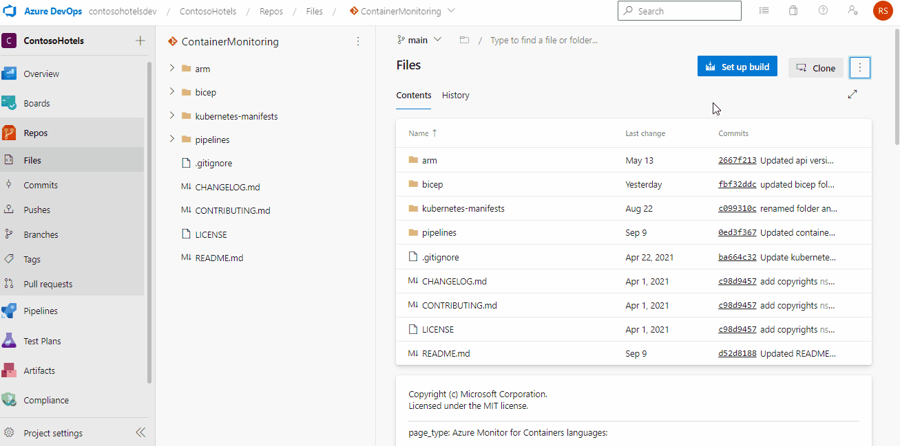

# Introduction
This project is dedicated to deliver monitoring capability of container insights for Azure kubernetes service (AKS). This helps team in identifying any issue within their cluster and performing root cause analysis.

# Azure Monitor for Containers
This solution help team in recreating this monitoring scenario within their environment.

## Contents

| File/folder                                      | Description                                |
|--------------------------------------------------|--------------------------------------------|
| `arm`                                            | ARM templates                             |
| `yaml`                                           | Kubernetes configuration files            |
| `.gitignore`                                     | Define what to ignore at commit time      |
| `CHANGELOG.md`                                   | List of changes                           |
| `CONTRIBUTING.md`                                | Guidelines for contributing               |
| `container-monitoring-pipeline.yml`              | Pipeline                             |
| `container-monitoring-environment.variables.yml` | Environment specific variables            |
| `container-monitoring-variables.yml`             | Pipeline variables                        |
| `LICENSE`                                        | License file                         |
| `README.md`                                      | Readme file                        |

## Prerequisites

* Contributor access to an azure subscription
* Azure DevOps project
* Permissions to create repositories, import and run pipelines
* ContosoSH360ClusterSPClientId - This contains client id which will be used in service profile
* ContosoSH360ClusterSPObjectId - This contain object id of above client id
* ContosoSH360ClusterSPClientSecret  - This contain client secret for above id
* chVmAdminPassword - This include windows profile password
* chVmAdminUser - This include windows profile username

## Setup

1. Clone/Fork the repository to your Azure DevOps project

    

2. Use an existing or create a new service connection as part of azure authentication from pipeline
3. Ensure that the Owner role is assigned to the service connection's service principal. This is required for role assignment within resource provisioning
4. Create a service principal for the Kubernetes cluster
5. Create a new pipeline in your project with existing Azure pipelines yaml file.

    

6. Enter below variables as pipeline secret variables

    - ContosoSH360ClusterSPClientId - This contains client id which will be used in service profile
    - ContosoSH360ClusterSPObjectId - This contain object id of above client id
    - ContosoSH360ClusterSPClientSecret  - This contain client secret for above id
    - chVmAdminPassword - This include windows profile password
    - chVmAdminUser - This include windows profile username

    

7. Update variables in Container-monitoring-environment.variables.yml variables file to match your environment naming convention
8. Update the container-monitoring-bicep-pipeline.yml pipeline to use your environment variables file
9. Container-monitoring-bicep-pipeline.yml pipeline to your Azure DevOps project

## Runnning the sample

1.  Run the pipeline

    

## Contributing

It is detailed under ["contributions.md"]() file which is present along with source code in the repository.