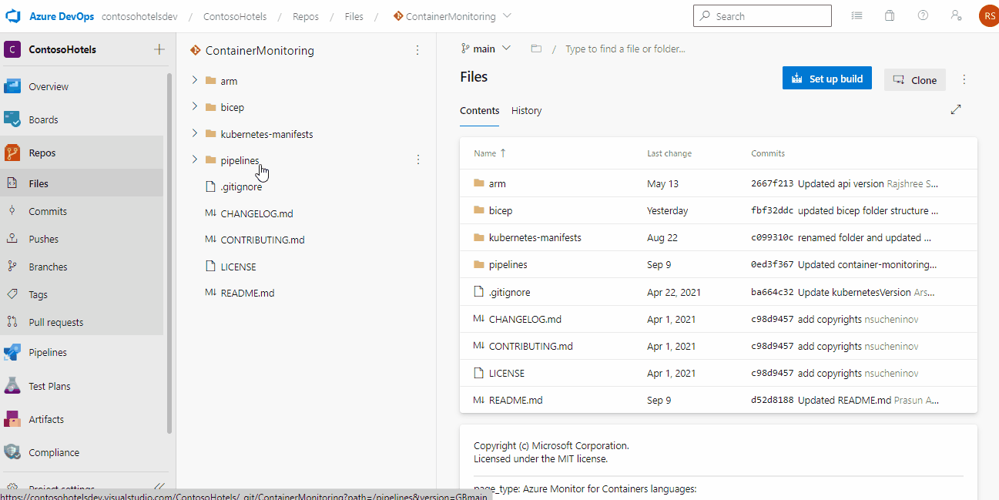
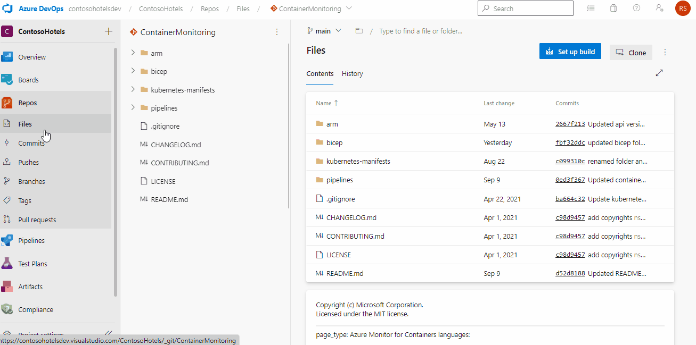
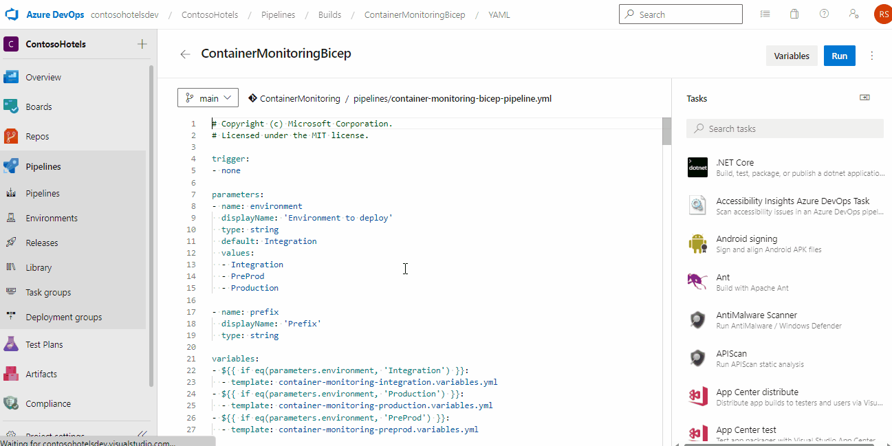
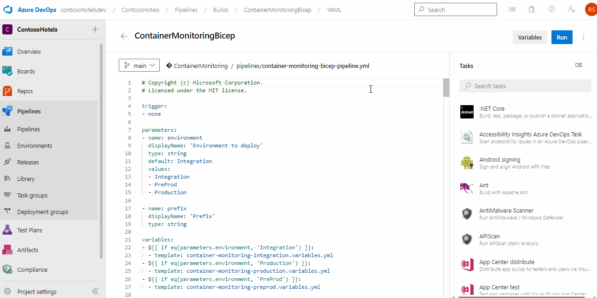

# Introduction
This project provides the below monitoring capabilities
- Showcase the difference between monitored and non-monitored cluster
- Container insight and health monitoring for AKS resources
- Identifying and troubleshooting the root cause for application slowness and failure

# Azure Monitor for Containers
This solution has been used to create an AKS monitoring scenario in the contoso demo environment, and can also be used by users to create replica in their own azure environment.

## Contents

| File/folder                                      | Description                                |
|--------------------------------------------------|--------------------------------------------|
| `arm`                                            | ARM templates                             |
| `bicep`                                            | Bicep templates                             |
| `yaml`                                           | Kubernetes configuration files            |
| `.gitignore`                                     | Define what to ignore at commit time      |
| `CHANGELOG.md`                                   | List of changes                           |
| `CONTRIBUTING.md`                                | Guidelines for contributing               |
| `container-monitoring-pipeline.yml`              | Pipeline                             |
| `container-monitoring-environment.variables.yml` | Environment specific variables            |
| `container-monitoring-variables.yml`             | Pipeline variables                        |
| `LICENSE`                                        | License file                         |
| `README.md`                                      | Readme file                        |

## Prerequisites

* Contributor access to an azure subscription
* Contributor permission on Azure DevOps project
* ContosoSH360ClusterSPClientId - This contains client id which will be used in service profile for authentication
* ContosoSH360ClusterSPObjectId - This contain object id of above client id
* ContosoSH360ClusterSPClientSecret  - This contain client secret for above client id which will be used in service profile for authentication
* chVmAdminPassword - This include windows profile password
* chVmAdminUser - This include windows profile username

## Setup

1. Clone/Fork the repository to your Azure DevOps project
- Forking

    

- Clone

    

2. Use an existing or create a new service connection as part of azure authentication from pipeline. Update service connection in Container-monitoring-environment.variables.yml.
    
3. Create a new pipeline in your project with existing Azure pipelines yaml file.

    

4. Enter below variables as pipeline secret variables

    - ContosoSH360ClusterSPClientId
    - ContosoSH360ClusterSPObjectId
    - ContosoSH360ClusterSPClientSecret
    - chVmAdminPassword
    - chVmAdminUser

    

7. Update variables in Container-monitoring-environment.variables.yml variables file to match your environment naming convention
8. Update the container-monitoring-bicep-pipeline.yml pipeline to use your environment variables file
9. Container-monitoring-bicep-pipeline.yml pipeline to your Azure DevOps project

## Runnning the sample

1.  Run the pipeline

    

## Contributing

It is detailed under ["contributions.md"]() file which is present along with source code in the repository.