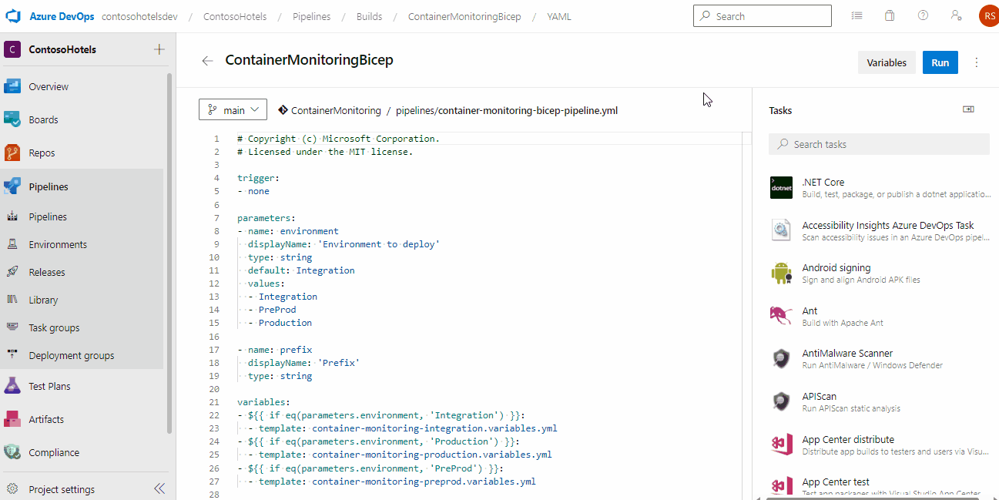

Copyright (c) Microsoft Corporation.  
Licensed under the MIT license.

---

[](https://portal.azure.com/#create/Microsoft.Template/uri/https%3A%2F%2Fdev.azure.com%2Fcontosohotelsdev.visualstudio.com%2FContosoHotels%2F_apis%2Fgit%2Frepositories%2FContainerMonitoring%2Fitems%3FscopePath%3D%2Fbicep%2Fmain.json%26api-version%3D6.0)

page_type: Azure Monitor for Containers
languages:
- ARM templates
products:
- kubernetes
description: "monitor an Azure Kubernetes Service (AKS) cluster with Azure Monitor for containers"
urlFragment: "update-this-to-unique-url-stub"
---

# Azure Monitor for Containers

<!-- 
Guidelines on README format: https://review.docs.microsoft.com/help/onboard/admin/samples/concepts/readme-template?branch=master

Guidance on onboarding samples to docs.microsoft.com/samples: https://review.docs.microsoft.com/help/onboard/admin/samples/process/onboarding?branch=master

Taxonomies for products and languages: https://review.docs.microsoft.com/new-hope/information-architecture/metadata/taxonomies?branch=master
-->

This solution deployes resources for the Azure Monitor for containers demo scenario.

## Contents

| File/folder                                      | Description                                |
|--------------------------------------------------|--------------------------------------------|
| `arm`                                            | ARM templates.                             |
| `yaml`                                           | Kubernetes configuration files.            |
| `.gitignore`                                     | Define what to ignore at commit time.      |
| `CHANGELOG.md`                                   | List of changes.                           |
| `CONTRIBUTING.md`                                | Guidelines for contributing.               |
| `container-monitoring-pipeline.yml`              | Pipeline.                             |
| `container-monitoring-environment.variables.yml` | Environment specific variables.            |
| `container-monitoring-variables.yml`             | Pipeline variables.                        |
| `LICENSE`                                        | The license.                               |
| `README.md`                                      | This README file.                          |

## Prerequisites

* Azure subscription
* You should be an owner of the subscription
* Azure DevOps project
* Permissions to create repositories, import and run pipelines

## Setup

1. Clone/Fork the repository to your Azure DevOps project

    

2. Create a service connection as part of azure authentication from pipeline
3. Ensure that the Owner role is assigned to the service connection's service principal. This is required for role assignment within resource provisioning
4. Create a service principal for the Kubernetes cluster
```
Use Get-AzADServicePrincipal to get ObjectId

        (Get-AzADServicePrincipal -DisplayName '<Service Principal Name>').Id
```
5. Create a new pipeline in your project with existing Azure pipelines yaml file.

    

6. Create variable group and enter below variables as pipeline secret variables

    - ContosoSH360ClusterSPClientId - This contains client id which will be used in service profile
    - ContosoSH360ClusterSPObjectId - This contain object id of above client id
    - ContosoSH360ClusterSPClientSecret  - This contain client secret for above id
    - chVmAdminPassword - This include windows profile password
    - chVmAdminUser - This include windows profile username

    

7. Update variables in Container-monitoring-environment.variables.yml variables file to match your environment naming convention
8. Update the container-monitoring-pipeline.yml pipeline to use your environment variables file
9. Container-monitoring-pipeline.yml pipeline to your Azure DevOps project

## Runnning the sample

1.  Run the pipeline

    

## Contributing

This project welcomes contributions and suggestions.  Most contributions require you to agree to a
Contributor License Agreement (CLA) declaring that you have the right to, and actually do, grant us
the rights to use your contribution. For details, visit https://cla.opensource.microsoft.com.

When you submit a pull request, a CLA bot will automatically determine whether you need to provide
a CLA and decorate the PR appropriately (e.g., status check, comment). Simply follow the instructions
provided by the bot. You will only need to do this once across all repos using our CLA.

This project has adopted the [Microsoft Open Source Code of Conduct](https://opensource.microsoft.com/codeofconduct/).
For more information see the [Code of Conduct FAQ](https://opensource.microsoft.com/codeofconduct/faq/) or
contact [opencode@microsoft.com](mailto:opencode@microsoft.com) with any additional questions or comments.

