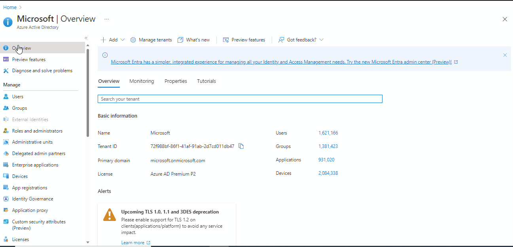

## Introduction
This project provides the below monitoring capabilities
- Showcase the difference between monitored and non-monitored cluster
- Container insight and health monitoring for AKS resources
- Help in identification of bug and root cause analysis

## Azure Monitor for Containers
This solution has been used to create an AKS monitoring scenario in the contoso demo environment, and can also be used by users to create replica in their own azure environment.

## Contents

| File/folder                                      | Description                                |
|--------------------------------------------------|--------------------------------------------|
| `arm`                                            | ARM templates                             |
| `bicep`                                            | Bicep templates                             |
| `kubernetes-manifests`                                           | Kubernetes configuration files            |
| `.gitignore`                                     | Define what to ignore at commit time      |
| `CHANGELOG.md`                                   | List of changes                           |
| `CONTRIBUTING.md`                                | Guidelines for contributing               |
| `container-monitoring-bicep-pipeline.yml`              | Pipeline                             |
| `container-monitoring-environment.variables.yml` | Environment specific variables            |
| `container-monitoring-variables.yml`             | Pipeline variables                        |
| `LICENSE`                                        | License file                         |
| `README.md`                                      | Readme file                        |

## Prerequisites

* Owner/Contributor with User access administrator permission to an azure subscription
* Contributor permission on Azure DevOps project
* Client id and secret from Application registration and Object id from enterprise application is required in azure environment

## Setup

1. Clone/Fork the repository to your Azure DevOps project
- Forking

    

- Clone

    

2. Use an existing or create a new service connection for azure subscription authentication with devops. 

    

3. Update service connection in _Container-monitoring-environment.variables.yml_.

    

4. Create a service principal for the Kubernetes cluster.

    

5. Create a new azure devops build pipeline in your project with existing yaml file within cloned/fork repo.

    

6. Enter below variables as pipeline secret variables

    - **ContosoSH360ClusterSPClientId** - Client id of an azure spn
    - **ContosoSH360ClusterSPObjectId** - Object id from enterprise application
    - **ContosoSH360ClusterSPClientSecret** - Client secret of an azure spn
    - **chVmAdminPassword** - Windows profile user password
    - **chVmAdminUser** - Windows profile username

    

7. **Optional:** Update variables in Container-monitoring-environment.variables.yml variables file to match your environment naming convention

## Pipeline execution

1.  Run the pipeline and add prefix based on your environment naming convention

    

## Contributing

It is detailed under [contributing.md](./CONTRIBUTING.md) file which is present along with source code in the repository.